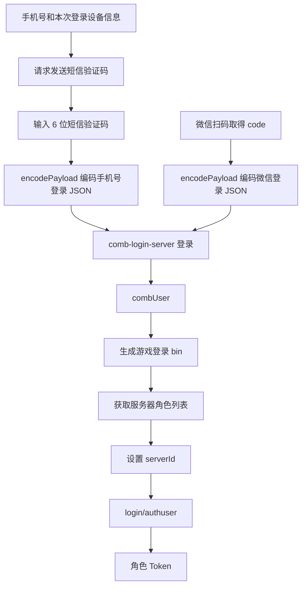

# 手机号登录协议抓包研究

> 记录日期：2026-08-25
>
> 本文基于 `mobile_login` 和 `mobile_login1` 两批本地抓包，以及当前仓库源码交叉验证。所有手机号、短信验证码、设备标识、签名、Token 和账号身份数据均不记录原值。
>
> 当前抓包工具只保存了出站请求。每组 `_raw` 都是 `_header + _body`，不包含 HTTP 响应。因此本文会明确区分已验证事实、合理推断和待响应包确认的内容。

## 1. 结论

手机号登录模式可以接入当前项目，协议可行性较高。

手机号登录和微信扫码登录的区别主要位于获取 `combUser` 之前：



两种方式都调用：

```text
POST https://comb-platform.hortorgames.com/comb-login-server/api/v1/login
```

并使用 [wxqrcode.vue](../src/views/TokenImport/wxqrcode.vue) 中现有的 `encodePayload()` 算法。组合登录成功后的 `combUser -> bin -> 角色列表 -> 角色 Token` 路径可以复用。

当前还不能准确实现服务端错误提示、发送频率限制和验证码过期处理，因为两批抓包都没有保存响应。

## 2. 数据来源与边界

### 2.1 第一批抓包

目录：`mobile_login`

只包含一次账号中心请求：

```text
POST /ucenter-app-server/api/v1/login/verify/code
Host: ucenter-app-server.hortorgames.com
Content-Type: application/json; charset=utf-8
```

该请求虽然路径包含 `verify/code`，但正文没有短信验证码。结合完整流程可确认，它在客户端行为上是“发送登录验证码”请求，不是“提交验证码完成登录”。

### 2.2 第二批抓包

目录：`mobile_login1`

共捕获 11 个出站请求，覆盖：

1. 发送验证码。
2. 重发验证码。
3. 手机号和短信验证码登录组合平台。
4. 防沉迷、日志和开关配置请求。
5. 向游戏服发送 `/login/authuser` 二进制认证包。

抓包中没有：

- HTTP 状态码。
- 响应头。
- 响应正文。
- `/login/authuser` 的二进制响应。

因此组合登录的响应结构目前是由现有扫码源码和后续认证包共同反证，尚未由手机号登录响应包直接确认。

## 3. 请求时间线

| 抓包 ID | 主机与路径 | 正文格式 | 判断 |
| --- | --- | --- | --- |
| `1787589725956` | `ucenter-app-server.hortorgames.com/ucenter-app-server/api/v1/login/verify/code` | 569 字节 JSON | 首次发送验证码 |
| `1787589807754` | 同上 | 569 字节 JSON | 重发验证码 |
| `1787589817676` | `comb-platform.hortorgames.com/comb-login-server/api/v1/login` | 1008 字节编码文本 | 提交手机号和短信验证码 |
| `1787589837795` | `/wxlog/api/v1/collect` | JSON | 平台日志，与获取 Token 无直接关系 |
| `1787589844787` | `/anti_addiction-server/api/v1/comb/upload/login` | JSON | 防沉迷登录上报 |
| `1787589850022` | `/anti_addiction-server/api/v1/comb/config/mobile/uniq` | GET | 防沉迷配置 |
| `1787589863578` | `/anti_addiction-server/api/v1/comb/ping` | JSON | 防沉迷心跳 |
| `1787589870308` | `platform-stat.hortorgames.com/htlog/api/v1/log/comb` | JSON | 平台统计日志 |
| `1787589878987` | `/comb-custom-switch-server/api/v1/switch/multi/status` | `text/plain` | 平台开关配置 |
| `1787589891861` | `xxz-xyzw.hortorgames.com/login/authuser?_seq=1` | 1053 字节 `lx` 二进制 | 游戏角色认证 |
| `1787589917277` | `platform-apm.hortorgames.com/apm/api/v1/collect` | JSON | APM 日志 |

两次验证码请求正文的 SHA-256 完全相同，间隔约 81.8 秒。第二次验证码请求约 9.9 秒后发起组合登录，符合“重发验证码后输入验证码并登录”的操作顺序。

## 4. 发送验证码请求

### 4.1 HTTP 结构

```http
POST /ucenter-app-server/api/v1/login/verify/code HTTP/1.1
Host: ucenter-app-server.hortorgames.com
Content-Type: application/json; charset=utf-8
```

正文是未加密 JSON。字段结构如下：

| 字段 | 类型 | 已观察语义 |
| --- | --- | --- |
| `gameId` | string | 固定为 `xyzwapp` |
| `gameTp` | string | 固定为 `app` |
| `accountNum` | string | 手机号，抓包中为 11 位 |
| `sysInfo` | string | JSON 字符串，包含系统、Hortor SDK 版本、型号和品牌 |
| `activeLoginMatchId` | string | 本次或当前登录上下文的匹配标识 |
| `channel` | string | 固定为 `android` |
| `verifyCodeTp` | string | 固定为 `login` |
| `distinctId` | string | DID 格式的设备标识 |
| `oaidThirdSdk` | string | 本次为空字符串 |
| `ipv6` | string | 本次为空字符串 |
| `limit` | boolean | 本次为 `true`，具体服务端语义待确认 |
| `packageName` | string | `com.hortor.games.xyzw` |
| `signPrint` | string | Android 应用签名指纹 |
| `androidId` | string | Android 设备标识 |
| `oaId` | string | 本次为空字符串 |
| `oaid` | string | 本次为空字符串 |

注意：正文同时包含大小写不同的 `oaId` 和 `oaid`。JavaScript `JSON.parse()` 可以保留这两个键，但 Windows PowerShell 5.1 的 `ConvertFrom-Json` 会因键名大小写冲突而失败。后续实现应按抓包原样保留字段，不要用大小写不敏感的数据结构处理中间结果。

### 4.2 `activeLoginMatchId`

观察到的格式为：

```text
<数字前缀>_<distinctId>
```

数字前缀并不等于本次抓包请求时间，因此不能直接认定它是当前的 `Date.now()`。它可能在 SDK 初始化或更早的登录尝试中生成。生成时机、有效期以及是否允许前端自行生成仍待确认。

## 5. 提交手机号和短信验证码

### 5.1 HTTP 结构

```http
POST /comb-login-server/api/v1/login
Host: comb-platform.hortorgames.com
Content-Type: text/plain; charset=utf-8
```

查询参数结构：

| 参数 | 抓包值或类型 |
| --- | --- |
| `gameId` | `xyzwapp` |
| `timestamp` | 秒级数字时间戳 |
| `version` | `android-4.2.1-cn-release` |
| `cryptVersion` | `1.1.0` |
| `gameTp` | `app` |
| `system` | `android` |
| `deviceUniqueId` | 与本次 DID 一致 |
| `packageName` | `com.hortor.games.xyzw` |

### 5.2 正文编码

1008 字节正文是 Base64 外层包裹的自定义编码文本。使用当前 [wxqrcode.vue](../src/views/TokenImport/wxqrcode.vue) 中 `decodePayload()` 的逆过程可以完整解码，得到 566 字节合法 JSON。这直接证明手机号登录和微信扫码登录使用相同的 `encodePayload()` 算法与密钥表。

算法流程为：

```text
JSON UTF-8
  -> Base64
  -> 使用重排后的 cipherTable 循环 XOR
  -> Base64
```

### 5.3 解码后的字段

| 字段 | 类型 | 已观察语义 |
| --- | --- | --- |
| `gameId` | string | `xyzwapp` |
| `gameTp` | string | `app` |
| `sysInfo` | string | 与验证码请求一致 |
| `activeLoginMatchId` | string | 与验证码请求完全一致 |
| `smsCode` | string | 用户输入的 6 位短信验证码 |
| `mobile` | string | 与验证码请求的 `accountNum` 完全一致 |
| `channel` | string | `android` |
| `distinctId` | string | 与验证码请求完全一致 |
| `oaidThirdSdk` | string | 本次为空字符串 |
| `ipv6` | string | 本次为空字符串 |
| `packageName` | string | `com.hortor.games.xyzw` |
| `signPrint` | string | 与验证码请求完全一致 |
| `tp` | string | `app-mobile` |
| `androidId` | string | 与验证码请求完全一致 |
| `oaId` | string | 本次为空字符串 |
| `oaid` | string | 本次为空字符串 |

经程序化比较，以下关系均成立：

```text
verifyRequest.accountNum === loginRequest.mobile
verifyRequest.activeLoginMatchId === loginRequest.activeLoginMatchId
verifyRequest.distinctId === loginRequest.distinctId
verifyRequest.androidId === loginRequest.androidId
verifyRequest.signPrint === loginRequest.signPrint
```

这说明发送验证码和提交验证码必须共享同一套登录上下文，不能在两步之间重新生成设备标识或匹配 ID。

## 6. 与微信扫码登录的字段对照

当前微信扫码实现位于 [wxqrcode.vue](../src/views/TokenImport/wxqrcode.vue)。两种登录方式的组合登录对比如下：

| 语义 | 手机号登录 | 微信扫码登录 |
| --- | --- | --- |
| 用户凭据 | `mobile` + `smsCode` | 微信 OAuth `code` |
| 登录类型 | `tp: app-mobile` | `tp: app-we` |
| 登录匹配上下文 | `activeLoginMatchId` | 当前实现未传 |
| 微信来源 | 不传 | `appFrom: com.tencent.mm` |
| 微信状态 | 不传 | `state: hortor` |
| 无登录模式 | 不传 | `noLogin: "2"` |
| 传输编码 | `encodePayload()` | `encodePayload()` |
| 组合登录接口 | 相同 | 相同 |
| 成功产物 | `combUser` | `combUser` |

### 6.1 当前扫码实现与原生手机号抓包的差异

不能直接复制当前扫码实现中的所有常量：

1. 原生手机号流程在发送验证码、组合登录正文和组合登录查询参数中使用同一个 DID。当前扫码实现的正文 `distinctId` 和查询参数 `deviceUniqueId` 是两组不同的固定值。
2. 原生手机号流程的正文和组合登录查询参数都使用 `com.hortor.games.xyzw`。当前扫码实现的查询参数使用 `com.hortorgames.xyzw`，中间少一个点。
3. 原生手机号流程使用 `android-4.2.1-cn-release` 对应的 SDK 信息。当前扫码正文的 `sysInfo` 仍写为 `4.0.6-cn`。
4. 手机号流程依赖 `activeLoginMatchId` 在两个请求间保持不变，扫码流程没有这个步骤。

这些差异不证明当前扫码流程一定错误，但手机号实现应优先遵循本次原生 App 抓包，不应照搬扫码页面里的固定设备数据。

## 7. 组合登录后的游戏认证 bin

抓包 `1787589891861_body` 是发送给：

```text
POST https://xxz-xyzw.hortorgames.com/login/authuser?_seq=1
Content-Type: application/octet-stream
O4e-Encoding: lx
```

使用现有 [bonProtocol.js](../src/utils/bonProtocol.js) 的 `g_utils.parse()` 可以成功解析为 `ProtoMsg`。顶层结构如下：

| 字段 | 类型或值 |
| --- | --- |
| `platform` | `hortor` |
| `oriPlatform` | 空字符串 |
| `platformExt` | `mix` |
| `info` | JSON 字符串 |
| `serverId` | number |
| `scene` | `0` |
| `referrerInfo` | 空字符串 |
| `deviceUniqueId` | DID 字符串 |

`info` 解码为 JSON 后只包含以下键：

| 字段 | 类型 |
| --- | --- |
| `encryptCombUser` | string |
| `sign` | string |
| `timestamp` | number |

这与当前扫码代码期望的 `combUser` 结构一致。捕获到的原生 bin 比扫码页面当前生成的对象多出 `oriPlatform` 和 `deviceUniqueId`。手机号模式生成 bin 时建议保留这两个字段，以尽量贴近原生请求。

由于抓包没有保存组合登录响应，当前证据链是：

```text
手机号组合登录请求
  -> 后续出现可解析的 authuser bin
  -> bin.info 是标准 combUser
  -> 因此组合登录已经成功返回了 combUser
```

这是强间接证据，但响应的外层 `meta/data` 格式仍需响应包直接确认。

## 8. 可复用的现有代码

### 8.1 可直接复用

- [wxqrcode.vue](../src/views/TokenImport/wxqrcode.vue) 的 `encodePayload()` 与相关编码函数。
- 同文件通过游戏加密模块将 `combUser` 封装为 bin 的逻辑。
- [token.ts](../src/utils/token.ts) 的 `getServerList()`。
- [token.ts](../src/utils/token.ts) 的 `transformToken()`。
- 微信扫码页面现有的服务器角色列表、角色选择、bin 重编码和 Token 入库逻辑。
- [bonProtocol.js](../src/utils/bonProtocol.js) 的 `g_utils.encode()` 与 `g_utils.parse()`。

### 8.2 实现时建议拆出的共享能力

当前 `encodePayload()`、`decodePayload()` 和 `combUser -> bin` 都写在微信扫码组件内部。新增手机号登录时，不应复制整套算法，建议先提取为共享登录工具，例如：

```text
src/utils/hortorLogin.ts
```

共享工具可以负责：

- `encodePayload(payload)`。
- 开发环境下受控的 `decodePayload(payload)`，生产代码不记录明文。
- `createLoginBin(combUser, options)`。
- 组合登录 URL 和公共设备字段构造。

手机号组件只负责：

- 手机号输入和本地格式校验。
- 发送验证码。
- 验证码倒计时。
- 提交验证码。
- 调用共享的角色列表和 Token 导入流程。

## 9. 代理与安全约束

当前 [vite.config.js](../vite.config.js) 和 [worker.js](../worker.js) 的 `/api/hortor` 只代理到：

```text
https://comb-platform.hortorgames.com
```

手机号登录还需要单独代理：

```text
https://ucenter-app-server.hortorgames.com
```

建议使用独立前缀，例如 `/api/hortor-ucenter`，避免把两个上游混在同一重写规则中。

短信接口不能直接接入当前允许任意来源的 Worker 代理。至少需要：

- 限制允许的前端 Origin。
- 按来源 IP 和手机号摘要限流。
- 不在日志中记录手机号、短信验证码、DID、`combUser` 或 Token。
- 不持久化短信验证码。
- 不把抓包中的设备标识和签名值当作用户身份凭据。
- 对上游返回体大小和 Content-Type 做限制。

手机号只应用于本次登录。成功生成 bin 后，应保存 bin 供现有刷新流程使用，不应保存手机号或短信验证码来尝试自动重新登录。

## 10. 尚未确认的问题

### 10.1 阻塞稳健实现的问题

1. `/login/verify/code` 成功响应的 HTTP 状态和 JSON 结构。
2. 发送过于频繁、手机号格式错误和达到每日上限时的错误码。
3. 组合登录成功响应是否与扫码实现一致，是否为 `meta.errCode` 和 `data.combUser`。
4. 短信验证码错误、过期和已使用时的错误码及文案。
5. `activeLoginMatchId` 的生成时机、有效期和服务端校验规则。

### 10.2 不阻塞主链、但值得补充的问题

1. `/login/authuser` 成功响应的实际二进制结构。
2. 新账号没有历史角色时，原生 App 是否先调用 `/login/serverlist`。
3. `limit: true` 是否控制发送频率、手机号绑定范围或其他账号中心策略。
4. `oaId` 和 `oaid` 是否必须同时存在，还是 SDK 兼容字段。
5. `oriPlatform` 和 `deviceUniqueId` 对游戏登录是否强制。

## 11. 下一次抓包清单

下次应启用同时保存请求和响应，并从点击“获取验证码”前开始，持续到角色进入游戏。优先保留以下数据：

### 必需

1. `/ucenter-app-server/api/v1/login/verify/code` 的成功响应：状态码、响应头、原始响应体。
2. `/comb-login-server/api/v1/login` 的成功响应：状态码、响应头、原始响应体。
3. `/login/authuser?_seq=1` 的成功响应：响应头和未经转换的二进制响应体。

### 建议补充

1. 输入错误验证码时的组合登录请求和响应。
2. 验证码过期后的组合登录响应。
3. 连续发送验证码触发限流时的响应。
4. 一次全新启动或清除 App 数据后的完整流程，用于确认 `activeLoginMatchId` 的生成来源。
5. 如果出现 `/login/serverlist`，保存其请求和响应二进制。

每条建议继续按以下形式保存：

```text
<时间戳>_request_header
<时间戳>_request_body
<时间戳>_request_raw
<时间戳>_response_header
<时间戳>_response_body
<时间戳>_response_raw
```

响应若启用 gzip，应保存工具解压后的正文和原始压缩响应，或至少明确文件属于哪一种。无需在聊天中粘贴敏感值，直接放在本地目录供脱敏分析即可。

## 12. 当前证据等级

| 结论 | 等级 | 依据 |
| --- | --- | --- |
| `/login/verify/code` 在本流程中用于发送验证码 | 已验证 | 正文无验证码、请求顺序、重复发送行为 |
| 手机号登录正文包含 `mobile` 和 6 位 `smsCode` | 已验证 | 使用仓库现有算法成功解码 |
| 手机号登录使用 `tp: app-mobile` | 已验证 | 解码后的真实请求 |
| 手机号和扫码登录复用 `encodePayload()` | 已验证 | 现有算法可无损解码手机号请求 |
| 手机号和扫码登录复用同一组合登录接口 | 已验证 | 请求主机和路径 |
| 手机号组合登录成功产生标准 `combUser` | 强间接证据 | 后续 authuser bin 的 `info` 可解析为标准 combUser |
| 手机号组合登录响应外层为 `meta/data` | 待确认 | 当前仅由扫码源码推断，没有响应包 |
| 当前项目可复用 bin、serverlist 和 authuser 后半程 | 已验证 | 现有解析器成功解析原生手机号登录 bin |
| `activeLoginMatchId` 可以自行用当前时间生成 | 未验证 | 数字前缀与本次请求时间不一致 |
